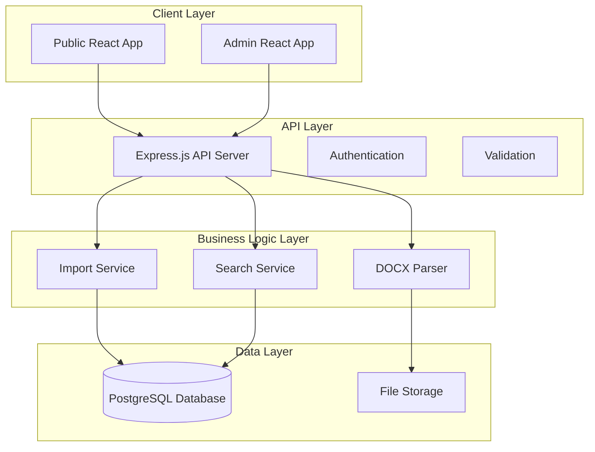
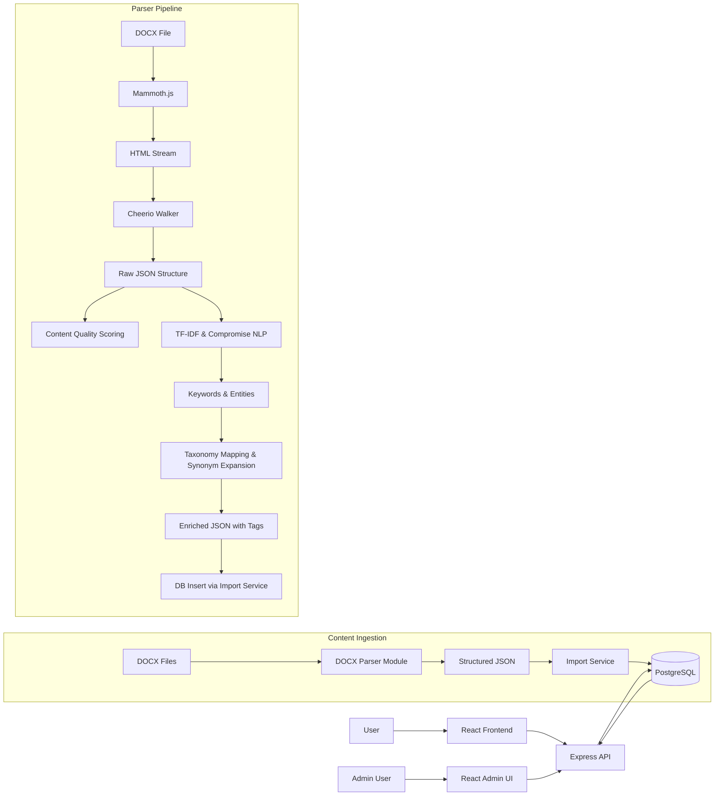
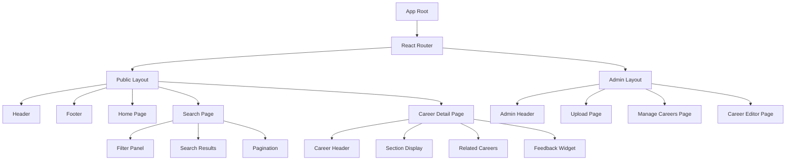
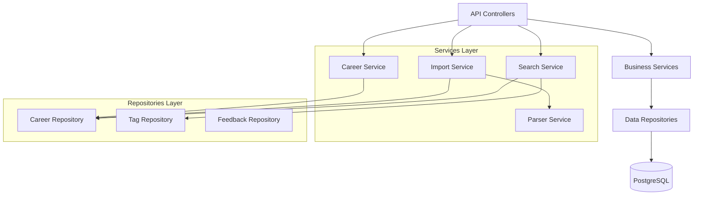

# System Architecture

> Comprehensive technical architecture documentation for the Career Options Explorer

## Overview

The Career Options Explorer is a full-stack web application built with a modern, scalable architecture. The system processes DOCX career documents, stores structured data, and provides both public and administrative interfaces for career exploration.

## High-Level Architecture



## Site Map

```mermaid
graph TD
    Home[Home Page] --> Search[Search Results]
    Home --> Categories[Categories Page]
    Home --> CareerDetail[/careers/:slug]
    Home --> About[About Page]
    Home --> FAQ[FAQ Page]
    Home --> Contact[Contact Page]

    Categories --> Search
    Search --> CareerDetail
    CareerDetail --> Search

    subgraph Admin
        direction LR
        AdminLogin[Admin Login] --> AdminDashboard[Admin Dashboard /admin]
        AdminDashboard --> UploadPage[Upload & Preview /admin/upload]
        AdminDashboard --> CareerMgmt[Manage Careers /admin/careers]
        AdminDashboard --> ParsingIssues[Parsing Issues /admin/parsing-issues]
        AdminDashboard --> FeedbackReview[Feedback Review /admin/feedback]

        CareerMgmt --> CareerEditor[Edit Career /admin/careers/edit/:id]
        ParsingIssues --> CareerEditor
    end
```

## Data Flow Architecture



## Database Schema

```mermaid
erDiagram
    CAREER {
        int id PK
        string title
        string slug UK "Unique, indexed"
        text snapshot
        text overview
        string status "e.g., draft, published, archived, parsing_issue"
        float quality_score "0.0-1.0, for admin review"
        string template_version "Nullable, version of DOCX template used"
        string source_docx_filename "Nullable, original filename"
        timestamp last_parsed_at "Nullable"
        text parsing_notes "Nullable, notes from parser on issues"
        timestamp created_at
        timestamp updated_at
    }

    SECTION {
        int id PK
        int career_id FK
        string title
        text content
        int display_order
        string section_type "Nullable, e.g., 'MISCELLANEOUS' if unmatched"
    }

    TAG {
        int id PK
        string name
        string category
        int parent_tag_id FK "Nullable, self-referencing for hierarchy"
        timestamp created_at
        timestamp updated_at
        UNIQUE(name, category)
    }

    CAREER_TAG {
        int career_id FK
        int tag_id FK
        float relevance_score "0.0-1.0, from NLP analysis"
        timestamp created_at
        PRIMARY_KEY(career_id, tag_id)
    }

    CAREER_SLUG_HISTORY {
        int id PK
        int career_id FK
        string old_slug
        timestamp changed_at
    }

    USER_FEEDBACK {
        int id PK
        int career_id FK
        string page_url
        boolean is_helpful
        text comment "Nullable"
        timestamp submitted_at
    }

    CAREER ||--o{ SECTION : "has"
    CAREER ||--o{ CAREER_TAG : "tagged with"
    CAREER ||--o{ CAREER_SLUG_HISTORY : "slug history"
    CAREER ||--o{ USER_FEEDBACK : "receives feedback"
    TAG ||--o{ CAREER_TAG : "applied to"
    TAG ||--o| TAG : "parent/child hierarchy"
```

## Component Architecture

### Frontend Components



### Backend Services



## Technology Stack

### Frontend
- **Framework**: React 18 with TypeScript
- **Build Tool**: Vite
- **Styling**: TailwindCSS (iOS-inspired theme)
- **Routing**: React Router DOM
- **State Management**: Zustand
- **HTTP Client**: Fetch API with custom wrapper
- **Forms**: React Hook Form
- **Testing**: Vitest + React Testing Library

### Backend
- **Runtime**: Node.js 20 LTS
- **Framework**: Express.js with TypeScript
- **Database**: PostgreSQL 14+
- **ORM/Query Builder**: Custom repository pattern with pg driver
- **Authentication**: JWT
- **Validation**: express-validator
- **File Upload**: Multer
- **Testing**: Jest + Supertest

### Document Processing
- **DOCX Parsing**: Mammoth.js
- **HTML Processing**: Cheerio
- **NLP**: Compromise.js
- **Text Analysis**: Natural (TF-IDF)
- **Keyword Extraction**: Custom implementation

### DevOps & Tools
- **Database Migrations**: db-migrate
- **API Documentation**: Swagger/OpenAPI
- **Logging**: Winston + Morgan
- **Code Quality**: ESLint + Prettier
- **Git Hooks**: Husky + lint-staged

## Security Architecture

### Authentication & Authorization
- JWT-based authentication for admin routes
- Role-based access control (Admin vs Public)
- Secure token storage and refresh mechanisms

### Data Protection
- Input validation and sanitization
- SQL injection prevention through parameterized queries
- XSS protection through content sanitization
- CORS configuration for cross-origin requests
- Rate limiting on API endpoints

### File Upload Security
- File type validation (DOCX only)
- File size limits
- Virus scanning (production recommendation)
- Secure file storage with access controls

## Performance Considerations

### Frontend Optimization
- Code splitting by routes
- Lazy loading of components
- Image optimization and lazy loading
- Client-side caching of API responses
- Bundle size optimization

### Backend Optimization
- Database indexing strategy
- Query optimization
- Response caching
- Pagination for large datasets
- Connection pooling

### Search Performance
- Full-text search indexing
- Faceted search optimization
- Result caching
- Efficient tag filtering

## Scalability Design

### Horizontal Scaling
- Stateless API design
- Database connection pooling
- Load balancer ready
- CDN integration for static assets

### Vertical Scaling
- Efficient database queries
- Memory usage optimization
- CPU-intensive task optimization (parsing)

## Monitoring & Observability

### Logging Strategy
- Structured logging with Winston
- Request/response logging with Morgan
- Error tracking and alerting
- Performance metrics collection

### Health Checks
- API health endpoints
- Database connectivity checks
- File system health monitoring

## Deployment Architecture

### Development Environment
- Local PostgreSQL instance
- Hot reloading for both frontend and backend
- Development-specific configurations

### Production Environment
- Containerized deployment (Docker)
- Managed PostgreSQL service
- CDN for static asset delivery
- SSL/TLS termination
- Environment-specific configurations

## API Design Principles

### RESTful Design
- Resource-based URLs
- HTTP method semantics
- Consistent response formats
- Proper status codes

### Versioning Strategy
- URL-based versioning (`/api/v1/`)
- Backward compatibility maintenance
- Deprecation notices

### Error Handling
- Consistent error response format
- Detailed error messages for development
- User-friendly messages for production
- Proper HTTP status codes

## Data Migration Strategy

### Database Migrations
- Version-controlled schema changes
- Rollback capabilities
- Data seeding for development
- Production migration procedures

### Content Migration
- Bulk DOCX import procedures
- Data validation and quality checks
- Error handling and recovery
- Progress tracking and reporting

---

*This architecture is designed to be maintainable, scalable, and secure while providing excellent user experience for both public users and administrators.*